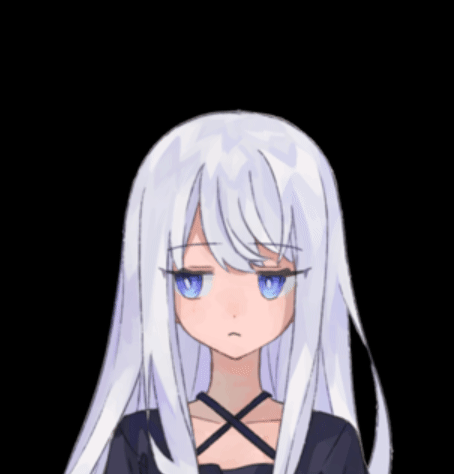
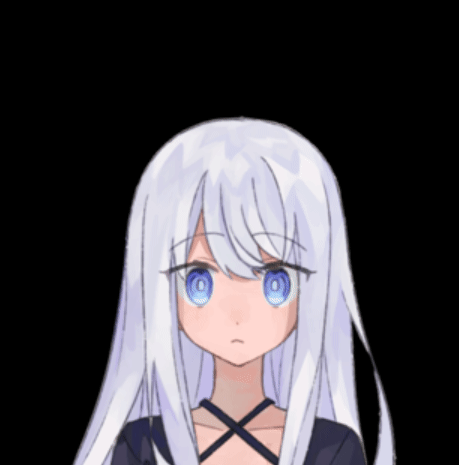
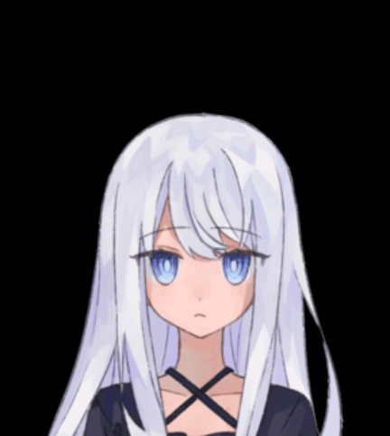
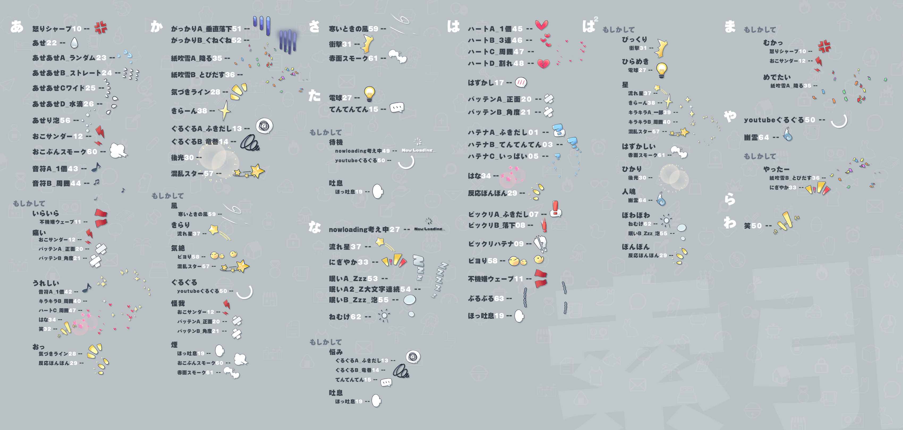

#  Icon Animations

This [Godot](https://godotengine.org/) addon includes some common emotion expression icon animations, which are generally used in dialogue or anywhere you want.

Sprites and pre-made SpriteFrames are included.

All the images come from スタジオデムサト, who generously released these for free on [booth](https://booth.pm/zh-cn/items/3122939). You can also see a preview of all the animations there.

The original images are too large for common game development in both size and resolution, so I've scaled them down to 20%. If you need higher-resolution images, feel free to download them from booth and replace them in the assets folder.

The license for all images in the assets folder is in the readme.txt.

## examples
(portrait is not included.)

